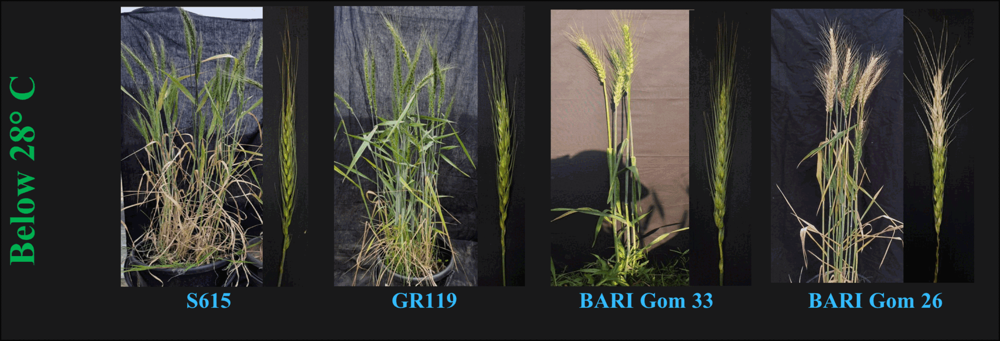

# About

## Welcome to Rojana Binte Azad's Website

Hello! I am Rojana Binte Azad, a passionate microbiology and molecular genetics researcher with a deep commitment to advancing agricultural and biological sciences. My journey began with a fascination for biological systems, leading me to pursue academic and research excellence in plant genetics, microbial interactions, and disease resistance.

With a solid foundation in agricultural science and biotechnology, I have spearheaded projects to improve wheat blast resistance and manage fungal pathogens. As the first woman in my family to pursue a PhD, I aim to inspire future generations to see research as achievable and transformative. In the future, I want to explore the molecular mechanisms of biological systems and contribute to innovative solutions for global challenges.

---

### My Interests
- Molecular biology and genetics  
- Plant-pathogen interactions  
- Sustainable agricultural solutions  
- CRISPR and genome editing technologies  
- Quantitative evolutionary microbiology

# Research

## Overview of My Research

### Current Work

I am currently working on a research project with [Dr. Toffazal Islam](https://en.wikipedia.org/wiki/Tofazzal_Islam), ..................

### **Blast Resistance in Wheat**
I have dedicated significant efforts to developing wheat varieties resistant to blast disease. My master’s thesis focused on integrating the *Rmg8* resistance gene from winter wheat (genotype S-615) into the Bangladeshi spring wheat variety BARI Gom 33. Through bioassays and marker-assisted screening, I successfully developed resistant lines, making it the first deployment of *Rmg8*-integrated wheat in Bangladesh. This project was funded by the Research Management Wing (RMW) at BSMRAU, where I served as the Principal Investigator. 

### **Pathogen Management and Bioactive Compounds**
As a Research Assistant in Dr. Tofazzal Islam’s team, I worked on isolating and characterizing fungal pathogens, including *Magnaporthe oryzae Triticum* (MoT) and *Bipolaris sorokiniana*. I also explored bacterial bioactive compounds as sustainable solutions for managing fungal diseases.

### **Mutation Breeding for Blast Resistance**
I contributed to a mutation breeding project, where we screened M4-generation wheat for blast resistance, identifying robust mutant populations resistant to disease.

### **Collaborations**
I have collaborated with researchers in Japan and Canada to genotype advanced wheat lines, expanding the scope and impact of my work on global agricultural challenges.

## Publications & Preprints

1. [Rmg8 gene against wheat blast.](https://doi.org/10.1038/s41477-024-01690-3) Islam, T., **Azad, R.B**. . Nat. Plants 10, 836–837 (2024).
    

        
**Abstract**

        Characterization of _Rmg8_, the major resistancegene for wheat blast found in common wheat,brought a surprise: it is a variant of _Pm4_, aresistance gene for powdery mildew disease. Both genes recognize the AVR-_Rmg8_ gene ofthe wheat blast fungus _Magnaporthe oryzaepathotype Triticum_ (MoT), which resultsin resistance against this pathogen. This discovery opens avenues for developing wheatvarieties to combat wheat blast disease. 
    

2. [Horizontal gene transfer from plant to whitefly.](https://doi.org/10.1016/j.tibtech.2023.01.007)
Islam, T., **Azad, R. B.**, Kasfy, S. H., Rahman, A. A., & Khan, T. Z. (2023). Trends in Biotechnology, 41(7), 853-856.
    

        
**Abstract**

        The recent discovery of the horizontal transfer of a toxin-neutralizing gene from plant to whitefly (_Bemisia tabaci_), a polyphagous insect, sparked a new area of study. In this forum, we discuss some potential biotechnological applications of this newly discovered knowledge in the coevolutionary arms race between plants and whitefly.
    

## Presentations

1. [Blast disease resistance of wheat genotypes carrying blast resistance genes _Rmg8_, _Rmggr119_, and _2NS_ translocation in the field.](https://doi.org/10.13140/RG.2.2.30677.23521) Ali, J., Haque, A., **Azad, R.**, Gupta, D., & Islam, T., 5th International Conference on Biotechnology in Health and Agriculture (ICBHA) 2023" Biotechnology for Sustainable Development in Agriculture, Environment and Health" Poster Presentation-Young Emerging Scientist (2023).

2. [Development of a durable blast resistant wheat variety by stacking of blast-resistance genes, _Rmg8_ and _2NS_ translocation.](https://www.researchgate.net/publication/383213182_Development_of_a_Durable_Blast_Resistant_Wheat_Variety_by_Stacking_of_blast-resistance_genes_Rmg8_and_2NS_Translocation) **Azad, R.**, Muzahid, A., Muzahid, M., Roy, C., Al, A., Rahat, A., Haque, A., Gupta, D., Gupta, & Islam, T., 5th International Conference on Biotechnology in Health and Agriculture (ICBHA) 2023" Biotechnology for Sustainable Development in Agriculture, Environment and Health" Oral Presentation-Young Emerging Scientist (2023).

3.  [Marker-assisted breeding for a durable blast resistant wheat variety by introgression of _RMG8_ gene into bari gom-33 carrying a _2NS_ translocation.](https://www.researchgate.net/publication/370943598_Marker-assisted_breeding_for_a_durable_blast_resistant_wheat_variety_by_introgression_of_Rmg8_gene_into_BARI_Gom-33_carrying_a_2NS_translocation) **Azad, R.**, Muzahid, A., Roy, P., Rahat, A., Haque, M., Gupta, D., & Islam, T., 5th Young Scientist Congress 25-27 November, 2022, Bangladesh Academy of Sciences, Dhaka - "Young Scientist for Health and Environment" Poster Presentation (2022).

# Academics

## Work Experience

- [Research Management Wing (RMW), Bangabandhu Sheikh Mujibur Rahman Agricultural University (BSMRAU)](https://www.researchgate.net/profile/Rojana-Azad) - (_January 2023 - July 2024_)
  - Principal Investigator 
  - I led the development of blast-resistant wheat varieties through bioassays, field tests, and marker-assisted breeding.
  
- [Institute of Biotechnology and Genetic Engineering (IBGE), Bangabandhu Sheikh Mujibur Rahman Agricultural University (BSMRAU)](https://ibge.bsmrau.edu.bd/) - (_January 2022 - December 2024_)
  - Research Assistant (RA) under [Dr. Tofazzal Islam](https://en.wikipedia.org/wiki/Tofazzal_Islam)
  - I conducted pathogen characterization, fungal management research, and resistance screening.  

---

## Education

### Graduate  

   - **Master of Science, Biotechnology and Genetic Engineering** - (_January 2022 - December 2024_)
   - Institute of Biotechnology (IBGE), Bangabandhu Sheikh Mujibur Rahman Agricultural University BSMRAU 
        - Academic Thesis: Resistance and yield performance on advanced wheat lines carrying 2NS translocation and _RMG8_ gene
        - CGPA: **4.00/4.00** (Ranked .... )

### Undergraduate  

   - **Bachelor of Science, Agriculture** - (_January 2017 - December 2021_)
   -  Bangabandhu Sheikh Mujibur Rahman Agricultural University (BSMRAU)** 
      - CGPA: **3.873/4.00** (Ranked .... in my major, top ... across all majors in the Faculty of Agriculture)
   
---

## Awards, Prizes, and Scholarships

- **Innovation Project Grant (Principal Investigator)**  
  Funded by Research Management Wing, BSMRAU  

- **Merit Scholarships**  
  Awarded for academic excellence during undergraduate and postgraduate studies  

